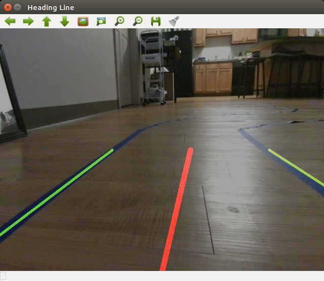

# DeepRacer Controllers

The packages in this repo are controllers for the AWS DeepRacer which command different behaviors for the robot including parallel parking and lane following using ROS nodes.

## Summary
This project, most simply put, is an exploration of general-purpose mobile robotics. I've set out to build multiple behaviors on the DeepRacer in a bid to understand the different skills needed by a roboticist. As of this writing, I've built parallel parking and lane-following ROS nodes that run on the robot with a decent level of robustness. My hope is that anyone reading this will leave knowing how to implement basic color thresholding, edge detection, and feature extraction using OpenCV's extensive libraries. You will also be able to write a simple python-based ROS package that implements the algorithm in near real-time. Lastly, I use the AprilTag detection libraries for the parallel parking functionality, and I detail some of the amazing features available courtesy of the amazing minds in the April Robotics Lab at the University of Michigan.

## Background
The AWS DeepRacer is a lovely piece of machinery developed by Amazon as a means to make Reinforcement Learning more accessible to people without a technical background. The vehicle boasts an Intel Atom processor running Ubuntu 16.04 which allows it employ the Robot Operating System (ROS), and Intel OpenVINO for visual processing (I did absolutely nothing with this framework). It sports a 4 megapixel wide-angle camera, one DC motor that controls all 4 wheels, and a steering servo. There's also an inertial measurement unit (IMU), which I haven't been able to access yet. A lot more about the DeepRacer can be found at [Amazon's DeepRacer introduction](https://aws.amazon.com/deepracer/).

I've been given the opportunity to tinker with one of these version 1 DeepRacers, and I'd like to share my experience.
I'll be sure to either explain as much as I can about my process, or attach links to the places I adapted the methods from.

## Lane Following
The basis of the algorithm I used in implementing lane-following on the robot is available in an amazingly written 6-part series by David Tian that begins [here](https://towardsdatascience.com/deeppicar-part-1-102e03c83f2c).

The basic idea behind the algorithm is divided into two:

#### Image Processing:

The rectified image stream from the DeepRacer's camera is first thresholded for the target lane colors in the hue-saturation-value (HSV) color space, as this provides a significantly higher performance across a wide brightness range. The edges of the found regions are then computed using the Canny edge detection algorithm. The computed edges are subsequently connected using the Probabilistic Hough line transform into line segments. These three algorithms are all readily available OpenCV functions, so there was no need to reinvent the wheel. The overall region of interest was reduced to the lower half of the image, since this is the area that the DeepRacer is immediately concerned with. The average slope of the remaining computed line segments was then used in calculating the detected lane lines which are used in part 2.

The images below show the progression of processed images, with the final detected lanes projected onto the original image.

 
  
  

#### Computing a Target Heading:

This portion of the algorithm is a convolution of my work and Tian's. This part takes the lane lines from part 1. There are two possible scenarios if a lane is visible - either both lane lines are visible (ideal scenario), or only one line is visible.

###### Two visible lane lines
When there are two visible lane lines, the task is reduced to computing the midpoint between the two endpoints and setting that as the target point. I then interpolate a line between the target and the center point at the bottom of the image (which I take as the camera's center). The angle this line makes with the positive y-axis gives the steering angle that's passed to the DeepRacer.

###### One visible lane line
With only one lane line, I had a little more difficulty computing the steering angle. I finally settled on simply computing a heading line parallel to the single visible line. In repeated testing, this method produced fair results, but I am not convinced on its robustness, and I am open to suggestions on doing this better.
That essentially concludes the basic lane following algorithm for the DeepRacer. I hope it helps provide a basis on developing a lane follower for any rover.

## Parallel Parking
In this section, I'll go over the algorithm developed to parallel park the robot. I want to preface this by pointing out that the algorithm is rather simplistic because of the limited sensing - a single camera meant the car had to rely on large portions of open loop control. This said, the parallel parking method is divided into two parts -

1. The DeepRacer starts at position 1 as seen in the image below, where it estimates the distance between tags 1 and 2, and determines if it can actually fit in the parking space
2. If it can, it then drives to position 2. This portion of the process is completely open loop
3. From position 2, it can then estimate its position relative to tag 3, and if it's within a specified region, it continues to actually park itself. Again, this portion is open loop, since we cannot sense its proximity to either of the boxes while it's parking.

Parking Setup

DeepRacer at Position 1

DeepRacer at Position 2

The purpose of writing this node was to give myself some experience in writing a publishing and subscribing ROS node which implemented multiple message types and incorporated visual information. The tags mentioned earlier are AprilTags, which are a family of markers that simplify a variety of depth-related image processing tasks. More information about the AprilTag project is available [here](https://april.eecs.umich.edu/software/apriltag). The standard AprilTag ROS node publishes the rotation and translation (pose) of the camera relative to any tags within the camera's field of view. It's this pose that I use in making sure the car can complete each stage of the process.

As I spend more time with the DeepRacer, I will keep improving the algorithms and increasing their number. I already have my eyes set on implementing object detection and tracking to remove the system's dependency on the AprilTag libraries.

## Links
1. [AWS DeepRacer](https://aws.amazon.com/deepracer/)
2. [DeepPiCar by David Tian](https://towardsdatascience.com/deeppicar-part-1-102e03c83f2c)
3. [Canny Edge Detection](https://docs.opencv.org/master/da/d22/tutorial_py_canny.html)
4. [Hough Line Transform](https://docs.opencv.org/3.0-beta/doc/py_tutorials/py_imgproc/py_houghlines/py_houghlines.html)
5. [AprilTag Fiducial System](https://april.eecs.umich.edu/software/apriltag)
